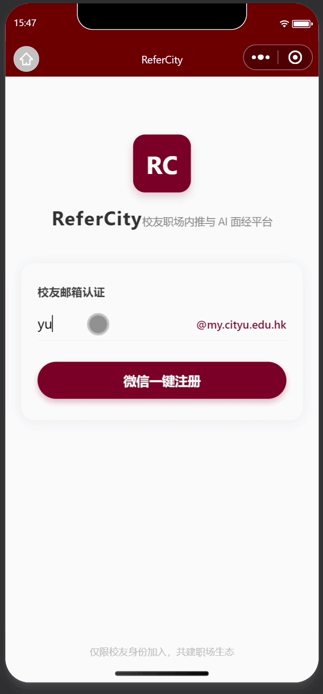

# 🌆 ReferCity: 基于 AI 与深度数据洞察的校友职场内推平台

> **ReferCity** - 链接 CityU 校友力量，用数据与 AI 铺就求职之路。
> 
> *A Data-Driven Career Intelligence Platform for CityU Community.*

---

## 🎯 1. 产品核心定位 (Product Positioning)
**ReferCity** 不仅仅是一个内推码展示板，它是校友求职的“智能导航仪”。
在当前的求职环境下，海量面经往往是碎片化、低质量的。我们通过 **Java 微服务 + DeepSeek RAG (检索增强生成)** 技术，将“内推资源”与“个性化诊断”结合，实现：
- **精准 Referral**: 港校身份核验，构建高价值校友圈。
- **AI 简历对齐**: 并非通用的修改建议，而是基于**目标岗位真实面经库**的深度比对。
- **数据洞察**: 自动提取面试高频考点，量化求职成功率。

## 📺 项目演示 (Demo)

  

> **说明**：演示展示了从用户上传简历到 RAG 引擎检索面经并生成 AI 匹配报告的完整闭环。

---

## 🏗️ 2. 技术架构图 (System Architecture)
ReferCity 采用典型的**工业级 AI 应用架构**，充分体现 BDA 对数据流转的严谨要求：

- **前端 (Frontend)**: 微信小程序 (提供极致的轻量化体验)。
- **后端 (Backend)**: Java Spring Boot 3.x + MyBatis Plus (核心业务逻辑)。
- **AI 引擎 (AI Engine)**: DeepSeek-V3 API (逻辑推理)。
- **数据层 (Data Layer)**:
  - **MySQL**: 存储用户信息、职位数据及内推状态。
  - **Vector Storage**: 存储结构化后的面经嵌入向量，支持语义搜索。
---

## 🚀 3. ReferCity 特色功能：AI 深度职场对标 (Core Features)

ReferCity 核心壁垒在于实现了“简历-岗位-校友库”的精准对齐，通过技术手段解决校友内推中的信息不对称问题。

### 📊 Python 极简雷达图模型 (Dimensional Matching)
* **五维指标对标**：基于 DeepSeek 深度解析，从 **技术能力、教育背景、项目经验、匹配程度、软实力** 五个核心维度进行结构化评分。
* **城大红视觉规范**：绘图引擎采用城大红 (#800000) 主色调，去除冗余网格，突出核心数据点，直观展示人才画像。
* **动态权重计算**：
  $$Match_{score} = \sum_{i=1}^{5} (Dimension_{i} \times Weight_{i})$$
  系统根据职位属性（如 PM 与 SDE）自动调整五大维度的权重占比。

### 🤖 流式 AI 匹配报告 (Streaming Analysis)
* **模拟思考交互**：前端采用流式渲染技术，模拟 AI 思考过程，逐字展示“优势与短板”深度分析。
* **打字机特效**：配合数字跳动动画与光标闪烁效果，显著提升用户获取分析报告的沉浸感。
* **面试锦囊插件**：针对特定岗位自动生成逐条面试建议，帮助候选人进行精准的面试前预演。

### 🎓 CityU 校友内推生态 (Alumni Referral)
* **城大内推背书**：实时提取校友圈急缺岗位（HC 急缺），为城大学生提供差异化的内推通道。
* **岗位深度画像**：精准拆解腾讯、字节等大厂职位的任职要求，将其与城大课程体系及校友成功案例进行关联匹配。

### 🔍 向量驱动面试真经 (Vector-based RAG)
* **语义语义关联**：不再依赖关键词匹配。通过 ChromaDB 与本地 Embedding 模型，即使搜索“高并发”，也能精准关联出包含“吞吐量优化”或“秒杀场景”的深度面经。
* **真题闭环**：在生成 AI 报告的同时，实时检索出库中关联度最高的 3-5 篇真实校友面经作为上下文（Context），确保 AI 建议有据可查。
* **知识长效化**：利用向量存储技术，将碎片化的校友面试分享转化为结构化的数字资产，实现校友内推生态的知识沉淀与复用。

---

## 🗺️ 4. 实施路线图 (Roadmap)

### 📍 第一阶段：产品定义与数据建模 (Ongoing)
- [x] **品牌升级**: 确立 **ReferCity** 品牌标识与视觉规范。
- [x] **需求工程**: 编写 `docs/PRD.md`，定义 MVP 版本功能边界。
- [x] **提示词工程**: 设计并测试针对 BDA 场景的 **"AI Interviewer" System Prompt**。

### 📍 第二阶段：微服务骨架与 AI 链路接入
- [x] 搭建 Java 核心服务，集成 DeepSeek API。
- [x] 实现基于 PDF 文本提取的简历解析器。
- [x] 建立初步的面经知识库。
- [x] 完善 Resume等 实体类，基于 MyBatis Plus 实现更复杂的 email_prefix 联表查询逻辑。

### 📍 第三阶段：数据分析与增长实验
- [x] **面试雷达**: 开发基于 Python 的面试趋势可视化组件。
- [x] **流式动态效果**：报告流式渲染: 优化前端小程序，实现 AI 匹配结果的“逐字加载”与“数字跳动”动画。

---

## 📂 5. 目录导航
- `/docs`: 产品文档 (PRD, API Spec, Database Schema)
- `/backend-service`: Java Spring Boot 源码
- `/miniprogram`: 小程序前端代码
- `/bda-scripts`: Python 爬虫与面经数据分析脚本

---
**Maintainer**: Zhou Yuqian | **Affiliation**: CityU Business Data Analysis (BDA)
